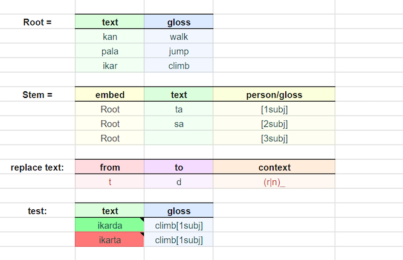

Gramble
=======

Gramble is a domain-specific programming language (DSL) for linguistic grammars and transducers (e.g. verb conjugators and parsers).  It fits roughly into the same niche as XFST/LEXC, but generalizes input-output transductions to arbitrary database-like queries.  

Handwritten grammars like FSTs underlie a lot of our team's products, and since switching to Gramble we've experienced huge productivity increases.  We estimate we write these about 10x faster (at least at in the early stages); we find that many new Gramble programmers have a working prototype of their system in 1-2 days rather than a few months.  Granted, we're biased!  But we really encourage you to give it a try.

The other twist of Gramble is that, unlike most other languages, it is a *tabular* programming language: its source code is a spreadsheet-like grid of cells, rather than a plaintext file:

Why?  Well, 99% of Gramble code/data ends up being tabular in nature: dictionaries of roots, conjugation tables, orthography charts, etc.  Rather than the programmer taking these tables and translating them into low-readability XFST code, these stay as tables.  The tables are the code itself, keeping the programmers and subject-matter experts on the same page.

To better support programmer/expert collaboration, we've also made a plug-in to Google Sheets (in `packages/sheets_addon`), letting you use Sheets as a multi-user IDE for Gramble programming.  It's not yet in the GSuite add-on "store", but in the meantime you can install it in your own Sheets using `clasp`.

Tutorials and documentation
---------------

Tutorials and language documentation can be found [here](https://nrc-cnrc.github.io/gramble/)

To install from source
---------------

Most users will not need to install from source unless you (a) want to run Gramble from the command line, (b) want to deploy your own Gramble add-on rather than use the one on Google Marketplace, or (c) if you are developing/maintaining Gramble itself.

Gramble is written in TypeScript, because ultimately it's made to execute in the browser so it's necessary that it transpiles smoothly to JavaScript.  For the command-line interface and to develop/test, we use [Node].  To install the multiple, interdependent packages in this repo we use npm.

[Node]: https://docs.npmjs.com/downloading-and-installing-node-js-and-npm

### Building and installing

First, make sure Node and npm are installed according to the instructions above.

Then, run the following command to install all dependencies and build the Gramble packages:

    npm install

Note: Users in a managed Windows environment may have trouble installing the `gramble` command because it requires a symbolic link.  If you run into this, run `npm install` as an adminstrator.

After the initial install of all dependencies, you can recompile the Gramble interpreter and/or cli packages at any time by running:

    npm run build

### Running from the command line

At this point, consider adding the path to `node_modules/.bin` to your system `PATH`.

For help info, try:

    gramble help

Alternatively, if you did not add `node_modules/.bin` to your `PATH`, you can instead run gramble as:

    ./node_modules/.bin/gramble help

or:

    npm run -- gramble help

or even (if, on Windows, you lack administrator privileges to install the `gramble` command):

    node packages/cli/bin/index.js help

Try generating from a sample file:

    gramble generate examples/helloworld.csv

If you want to generate from a particular symbol in that file, you can specify this with `-s`.  By default, it generates from the symbol `<sourcefile>.all`.

    gramble generate examples/helloworld.csv -s helloworld.greeting

If your grammar is large, generating can be correspondingly slow, so if you just want a few samples you can use the `sample` subcommand.  The following command generates 10 samples from the grammar:

    gramble sample examples/helloworld.csv -n 10

### Running the Gramble tests

To run the tests for all packages:
    
    npm test

To run all the interpreter tests in the tests package:

    npm run tests test

To run a specific interpeter test suite, for example:

    npm run tests testGrammarBasic

To get a list of all scripts available in the tests package:

    npm run tests

Copyright
---------

All files in this repository are **Copyright © 2020 National Research Council Canada.**

License
-------

All files in this repository are released under the MIT licence. See the [LICENSE](LICENSE) file for details.
