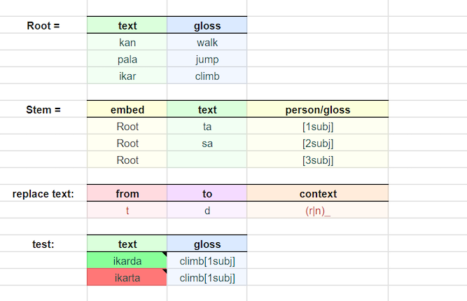

## What is Gramble?

Gramble is a declarative, domain-specific programming language (DSL) for linguistic parsing and generation.  (For example, you could use it to turn Swahili `{text:ninapenda}` into `{root:pend, tense:present, subject:1SG}`, or vice-versa.)  

If you've heard of the XFST, LEXC, or TWOLC languages, it fits roughly into the same niche, but it's got a rather different syntax/semantics/philosophy.  Why not just use those languages?  We had two main reasons.  

## Reason 1:

The first (but ultimately minor) reason is that we needed some additional capabilities and features that these languages didn't happen to have.  

## Reason 2:

But the bigger reason was social/practical.  A lot of our teams' products involve handwritten linguistic programs in languages like XFST (and sometimes just in Python), but when we handed over the source to our clients (often teachers or linguists), they couldn't make heads or tails of it.  They didn't feel confident that they could maintain or make changes if necessary, and were concerned about having a lifetime dependency on the availability of the original author.  

Gramble is our attempt to make a linguistic DSL that's readable and even writable by non-programmers.  Our goal is to hand over the source and have the client say, "That makes sense to me, I think I could modify this if I had to."  Meanwhile, we find our own programmers to be much more productive in this system.

## Gramble's one weird trick

The "one weird trick" of Gramble is that it's a *tabular* programming language.  The spreadsheet-looking thing below is the actual code: everything in Gramble is expressed as a grid of cells.  

Why?  Well, for one, about 90% of these programs ends up being tabular in nature -- for a lot of kinds of data they're the most concise and readable expression -- and it's handy to be able to simply write your tables in an editor that knows about columns and such.  But also, spreadsheets are the lingua franca of knowledge work.  Few of our teacher/linguist collaborators happen to be programmers as well, but most knowledge workers are familiar with Excel or Google Sheets.
